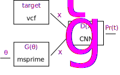

(sec_guide_creating_a_dinf_model)=
# Creating a Dinf model

This page discusses how to construct a minimal simulation-only Dinf model.
It provides code examples for each component, and the complete
working model can be found at the bottom of the page,
or in the [git repository](https://github.com/RacimoLab/dinf)
under `examples/bottleneck/model.py`.
Writing a Dinf model requires a familiarity with Python,
and the examples use
[demes](https://popsim-consortium.github.io/demes-docs/),
[msprime](https://tskit.dev/msprime/docs/stable),
and [numpy](https://numpy.org/doc/stable/)
APIs.

## Overview

The primary use of Dinf is to infer simulation parameters that
produce data closely resembling some target empirical dataset.
In the diagram below, the rectangles represent the major components of
a Dinf model, and the arrows indicate the flow of data.



- $\theta$ are the model parameters,
  such as population sizes, split times, or migration rates.
- $G(\theta)$ is the generator
  (e.g. [msprime](https://tskit.dev/msprime/docs/stable)),
  that simulates genetic data for concrete values of the model parameters.
- $target$ is the target dataset (e.g. a vcf).
- $x_t$ and $x_g$ indicate data features from the
  target and the generator respectively.
- $D(x)$ is the discriminator (e.g. a convolutional neural network),
  which is trained to distinguish between data generated by the
  generator and the target dataset.
- $Pr(t)$ is the prediction from the discriminator---the probability that
  a given input feature is from the target distribution.

A Dinf model is organised as a Python script (a `.py` file)
containing a `dinf_model` variable,
which must be an instance of the {class}`.DinfModel` class.
This object describes various components of the model.

```python
import dinf

dinf_model = dinf.DinfModel(
    parameters=parameters,
    feature_shape=features.shape,
    generator_func=generator,
    target_func=None,
)
```

Defining the model then procedes by defining the `parameters`,
writing the `generator_func` function,
writing the `target_func` function (if any),
and describing the `feature_shape`---the shape of the
features produced by both the generator and the target function.
It's not necessary to specify the architecture of the discriminator.

## Parameters

In this example, we'll have two inferrable parameters,
`N0` and `N1`, which correspond to the population sizes of a
deme before and after a bottleneck.
{attr}`.DinfModel.parameters` are defined via the {class}`.Parameters` class,
whose constructor accepts named {class}`.Param` instances by keyword.
Each keyword is the name of a parameter (`N0` and `N1` in the code below)
and each parameter has a lower bound (`low`) and an upper bound (`high`).
Parameters defined in this way have a uniform prior, e.g.
`N0`$\sim$Uniform(10, 30000).
When performing a simulation study (as we'll do here), the `truth` value
will be used to produce the target dataset instead of using empirical data.


```python
parameters = dinf.Parameters(
    N0=dinf.Param(low=10, high=30_000, truth=10_000),
    N1=dinf.Param(low=10, high=30_000, truth=200),
)
```

## Generator

The generator is probably the most complicated part of the Dinf model.
A genetic simulator must take the parameters and turn them into
genetic data. The genetic data must then be transformed to
match the expected input of the discriminator. The inputs to the discriminator
are referred to as the *features* of the data, and the transformation
of the genetic data into the desired format is referred to as
*feature extraction*.


### Features

It's important that there is agreement between the features extracted from the
generator and the features extracted from the target dataset.
Ideally, the only differences will be due to the accuracy of the simulation
model and the parameter values, not due to data filtering or quality issues.
To ensure consistency, the Dinf API provides helper classes for
feature extraction that have methods for extracting features from
vcf files and from {class}`tskit.TreeSequence` objects.
In this example, we'll use the {class}`.BinnedHaplotypeMatrix` feature
extractor class.


```python
num_individuals = 16

features = dinf.BinnedHaplotypeMatrix(
    num_individuals=num_individuals,
    num_loci=64,
    ploidy=2,
    phased=False,
    maf_thresh=0.05,
)
```

To initialise the discriminator, Dinf needs to know the shape of the features
that the discriminator will be given. These features are typically
multidimensional arrays (or a collection of multidimensional arrays,
when modelling multiple populations), where the feature shape is a tuple of
array dimensions of the feature.
The `features` object defined above has a `shape` property that can used for the
{attr}`.DinfModel.feature_shape`.

### Genetic simulator

{attr}`.DinfModel.generator_func` is a user-defined function that produces data
features matching the `feature_shape`.
The function accepts a single positional argument `seed`,
followed by one keyword argument for each inferrable parameter.
So for our example there's one argument for `N0` and one for `N1`.
Note that the python syntax `def generator(seed, *, N0, N1):` means
that all parameters after the `*` are keyword-only parameters.
The generator function must return the features that were extracted
from the simulated data.

There are a lot of choices to be made when simulating genetic data.
In the example below, the bottleneck demographic model is described using
a templated [Demes YAML](https://popsim-consortium.github.io/demes-spec-docs/)
string.
This demographic model is simulated using the
[msprime](https://tskit.dev/msprime/docs/stable)
coalescent simulator, whose output is a {class}`tskit.TreeSequence`.
Finally, the features are extracted from the output using the
{meth}`.BinnedHaplotypeMatrix.from_ts` method of the `features` object
we defined above.

```python
import string

import demes
import msprime
import numpy as np


recombination_rate = 1.25e-8
mutation_rate = 1.25e-8
sequence_length = 1_000_000


def demography(*, N0, N1):
    model = string.Template(
        """
        description: Two-epoch model with recent bottleneck.
        time_units: generations
        demes:
          - name: A
            epochs:
              - start_size: $N0
                end_time: 100
              - start_size: $N1
                end_time: 0
        """
    ).substitute(N0=N0, N1=N1)
    return demes.loads(model)


def generator(seed, *, N0, N1):
    """Simulate a two-epoch model with msprime."""
    rng = np.random.default_rng(seed)
    graph = demography(N0=N0, N1=N1)
    demog = msprime.Demography.from_demes(graph)
    seed1, seed2 = rng.integers(low=1, high=2**31, size=2)

    ts = msprime.sim_ancestry(
        samples=num_individuals,
        demography=demog,
        sequence_length=sequence_length,
        recombination_rate=recombination_rate,
        random_seed=seed1,
        record_provenance=False,
    )
    ts = msprime.sim_mutations(ts, rate=mutation_rate, random_seed=seed2)

    feature_matrix = features.from_ts(ts)
    return feature_matrix
```

Note that Dinf has no explicit requirement to use `demes`
for the demographic model, nor to use `msprime` as the simulator.
It would even be possible to write a generator function with a
simulator that doesn't output a `tskit.TreeSequence`.
Dinf provides [discriminator networks](sec_api_discriminator_networks)
that work well with the provided
[feature extraction classes](sec_api_feature_extraction),
so substituting custom features will likely require additional effort
and testing.

## Target

When defining the {class}`.DinfModel` object above,
we set `target_func=None`. This means that Dinf will reuse the
generator function to create the target dataset. When simulating the
target dataset, the `truth` values specified for the parameters
will be passed to the generator function.

## Discriminator

We have not specified anything about the discriminator.
By default Dinf will use {class}`.ExchangeableCNN`,
a small exchangeable convolutional neural network,
that treats haplotypes within populations as exchangeable.

## Complete example

Putting this all together into one file we obtain:

```{literalinclude} ../../examples/bottleneck/model.py
:language: python
```
